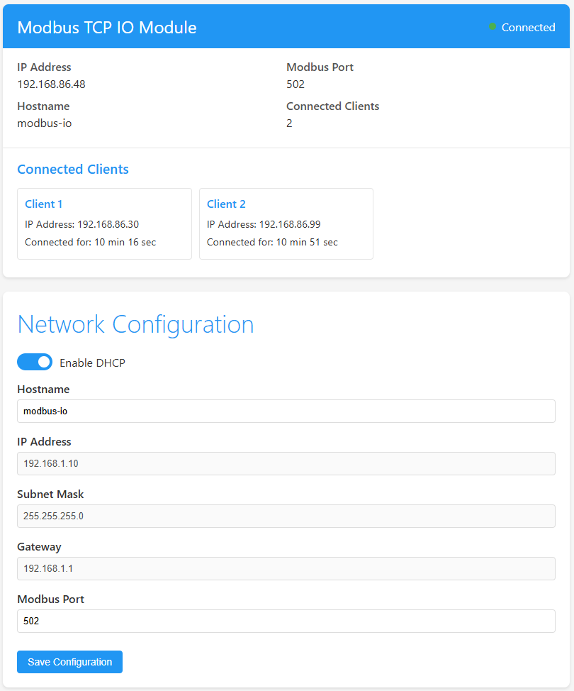
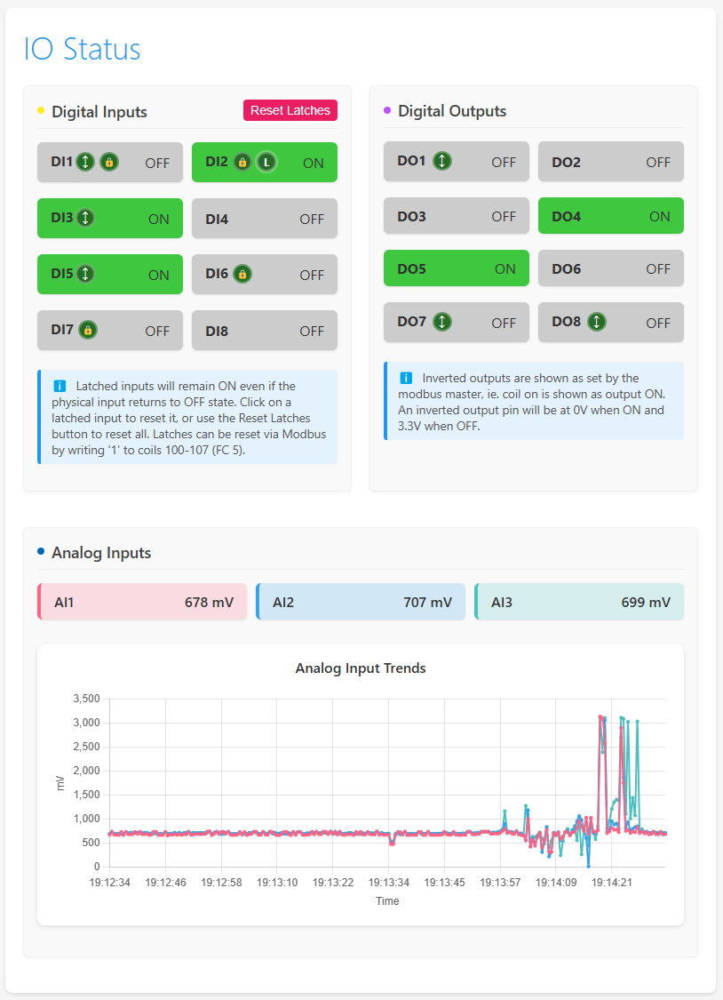
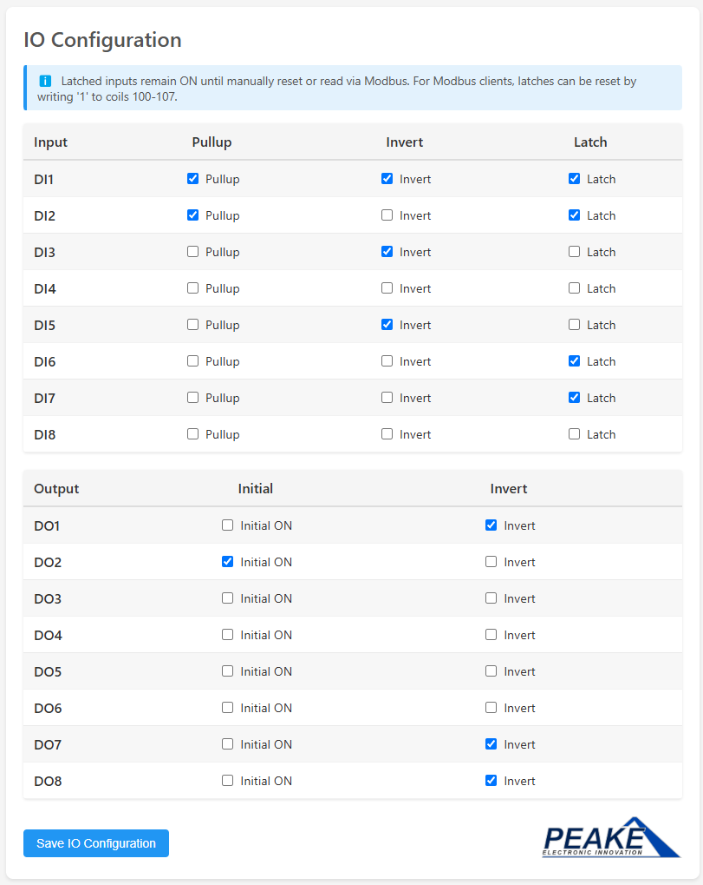

# Modbus TCP IO Module - Enhanced

A flexible Ethernet-based Modbus TCP IO module built on the Wiznet W5500-EVB-Pico board (RP2040). Features a modern web interface for configuration and real-time monitoring with support for multiple sensor types, mathematical calibration, and built-in diagnostic tools.

## 🆕 Latest Enhancements (v2.0.0 - September 9, 2025)

### Multi-Sensor Type Support
- **I2C, UART, Digital, and Analog** sensor types
- **Mathematical Formula Conversion**: Custom calibration expressions (e.g., `(x * 1.8) + 32`)
- **Engineering Units**: Display converted values with proper units (°C, %, psi, etc.)
- **Terminal Interface**: Built-in diagnostics with network and sensor commands

### Diagnostic Terminal
- **Network Commands**: `ipconfig`, `arp`, `ping`, `tracert`
- **Sensor Commands**: `sensor list`, `sensor read <id>`, `sensor info <id>`, `sensor test <id>`
- **Real-time Troubleshooting**: Immediate feedback for system diagnostics


## Features

### Network Configuration
- DHCP support with fallback to static IP
- Configurable network settings via web interface
- Custom hostname support
- Real-time IP address display
- Built-in LED indicates Modbus client connection status

### IO Capabilities
- **Digital Inputs**: 8 channels (GP0-GP7)
  - Configurable pullup resistors
  - Input inversion option
  - Latching capability (inputs remain ON until reset)
  - Latch reset via web interface or Modbus
- **Digital Outputs**: 8 channels (GP8-GP15)
  - Toggle outputs directly from web interface
  - Configurable initial state (ON/OFF at startup)
  - Output inversion option
  - Real-time status updates
- **Analog Inputs**: 3 channels (GP26-GP28)
  - 12-bit resolution (0-4095)
  - 3.3V reference voltage
  - Values displayed in millivolts (0-3300mV)
  - Real-time trend graphs

### I2C Sensor Support
- Configurable I2C sensors via web interface
- EZO sensor support (pH, DO, EC with calibration commands)
- Temperature compensation for pH measurements
- Dynamic sensor configuration and calibration
- Sensor data available via Modbus and web interface

### Modbus Server
- Protocol: Modbus TCP
- Default Port: 502
- Register Map:
  - **Discrete Inputs (FC2)**: 16 inputs
    - 0-7: Digital input states
  - **Coils (FC1/FC5)**: 128 coils
    - 0-7: Digital output control
    - 100-107: Digital input latch reset
  - **Input Registers (FC4)**: 32 registers
    - 0-2: Analog input values (millivolts)
    - 3+: Available for I2C sensor data
  - **Holding Registers (FC3/FC16)**: 16 registers

### Web Interface






- Modern, responsive design
- Live IO status updates
- Interactive digital output control
- Digital input latch reset functionality
- Configuration management
  - Network settings (DHCP toggle, IP configuration)
  - IO configuration with table-based layout
  - I2C sensor configuration and calibration
- Real-time monitoring
  - Digital input/output states
  - Analog input values with trend graphs
  - Connected Modbus clients
  - I2C sensor data
- Sensor management
  - Add/edit/delete I2C sensors
  - EZO sensor calibration interface
  - Compact register usage summary

## Hardware

### Board
- **Module**: Wiznet W5500-EVB-Pico
- **Processor**: RP2040 (Dual-core ARM Cortex-M0+)
- **Ethernet**: W5500 with lwIP stack
- **Power**: USB or PoE (requires PoE module)
- **USB**: Custom VID/PID for unique device identification

### IO Pin Assignments

#### Digital IO

| Function | GPIO Pin | Description |
|----------|----------|-------------|
| DI1 | GP0  | Digital Input 1 |
| DI2 | GP1  | Digital Input 2 |
| DI3 | GP2  | Digital Input 3 |
| DI4 | GP3  | Digital Input 4 |
| DI5 | GP4  | Digital Input 5 |
| DI6 | GP5  | Digital Input 6 |
| DI7 | GP6  | Digital Input 7 |
| DI8 | GP7  | Digital Input 8 |
| DO1 | GP8  | Digital Output 1 |
| DO2 | GP9  | Digital Output 2 |
| DO3 | GP10 | Digital Output 3 |
| DO4 | GP11 | Digital Output 4 |
| DO5 | GP12 | Digital Output 5 |
| DO6 | GP13 | Digital Output 6 |
| DO7 | GP14 | Digital Output 7 |
| DO8 | GP15 | Digital Output 8 |

#### Analog Inputs

| Function | GPIO Pin | ADC Channel | Range |
|----------|----------|-------------|--------|
| AI1 | GP26 | ADC0 | 0-3300mV |
| AI2 | GP27 | ADC1 | 0-3300mV |
| AI3 | GP28 | ADC2 | 0-3300mV |

#### Ethernet Interface

| Function | GPIO Pin |
|----------|----------|
| CS   | GP17 |
| IRQ  | GP21 |
| SCK  | GP18 |
| MOSI | GP19 |
| MISO | GP16 |

#### I2C Interface

| Function | GPIO Pin | Description |
|----------|----------|-------------|
| SDA | GP24 | I2C Serial Data |
| SCL | GP25 | I2C Serial Clock |

*Note: I2C bus is initialized and ready for sensor connections. Sensors can be configured dynamically via the web interface.*

## Development

### Environment
- PlatformIO
- Framework: Arduino
- Board: Raspberry Pi Pico
- Core: Earlephilhower's Arduino core

### Dependencies
- Arduino Framework
- W5500lwIP Ethernet Library
- ArduinoModbus
- ArduinoJson
- LittleFS for file system operations

### Building and Flashing
1. Clone the repository
2. Open in PlatformIO
3. Build and upload to the board

## Configuration

### Default Network Settings
- DHCP: Enabled
- Fallback Static IP: 192.168.1.10
- Subnet: 255.255.255.0
- Gateway: 192.168.1.1
- Modbus Port: 502

### Memory Layout
- Configuration stored in LittleFS
- Version control for config structure
- Automatic migration of settings

## Usage

1. Power up the board via USB or PoE
2. Connect to network via Ethernet
3. **Upload LittleFS file system image:**
  - In PlatformIO, use the command palette and select `PlatformIO: Upload File System Image` to upload the contents of the `data/` directory (web assets) to the device.
  - This step is required for the web interface to function. If skipped, you will get a "404 Not Found" error when accessing the web page.
4. Access web interface via IP address
5. Configure network settings if needed
6. Configure IO settings as required:
  - Set digital input pullup, inversion, and latching options
  - Configure digital output initial state and inversion options
7. Control digital outputs via web interface or Modbus
8. Monitor inputs and outputs in real-time
9. Reset latched inputs via web interface or by writing to Modbus coils 100-107

## Debugging
- Serial debug output (115200 baud)
- Web interface status indicators
- Modbus client connection monitoring
- Built-in LED indicates Modbus client connection

## Sensor Configuration

### Supported Sensors

#### EZO Sensors (Atlas Scientific)
- **EZO-pH**: pH measurement with temperature compensation
- **EZO-DO**: Dissolved oxygen measurement  
- **EZO-EC**: Electrical conductivity measurement
- **EZO-RTD**: High-precision temperature measurement

EZO sensors include built-in calibration routines accessible via the web interface.

#### Adding Custom Sensors

To add support for new I2C sensor types:

1. **Add Sensor Library** (if needed) to `platformio.ini`:
   ```ini
   lib_deps = 
       # Existing libraries...
       your/sensor-library@^1.0.0
   ```

2. **Implement Sensor Reading Logic** in `src/main.cpp`:
   ```cpp
   // Add to the sensor reading loop around line 810
   else if (strcmp(configuredSensors[i].type, "YOUR_SENSOR") == 0) {
       // Add your sensor reading code here
       float sensorValue = yourSensor.readValue();
       // Store or process the value as needed
   }
   ```

3. **Configure via Web Interface**: Use the sensor configuration page to add your sensor with appropriate I2C address and Modbus register mapping.

### Web-Based Configuration

1. **Access Web Interface**: Connect to the device IP address
2. **Navigate to Sensor Configuration**: Scroll to the sensor configuration section
3. **Add New Sensor**: Click "Add Sensor" and fill in:
   - Name (descriptive label)
   - Type (sensor model/type)
   - I2C Address (in hex format, e.g., 0x48)
   - Modbus Register (starting from register 3)
4. **Calibration**: Use built-in calibration tools for supported sensors
5. **Save Configuration**: Click "Save & Reboot" to apply changes

### Troubleshooting

- **Check I2C Wiring**: Verify SDA (GP24) and SCL (GP25) connections
- **Verify I2C Address**: Ensure the sensor address matches configuration
- **Power Requirements**: Most sensors require 3.3V power supply
- **Serial Monitor**: Check debug output for sensor initialization messages
- **Pull-up Resistors**: Some sensors may need external 4.7kΩ pull-ups on SDA/SCL
