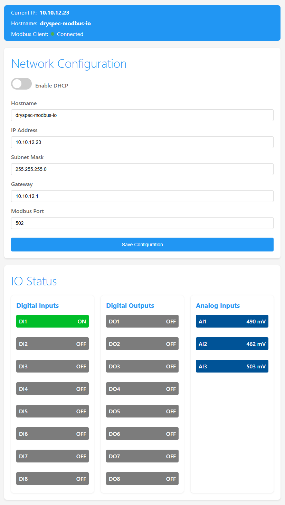

# Modbus TCP IO Module

A flexible Ethernet-based Modbus TCP IO module built on the Wiznet W5500-EVB-Pico board (RP2040). Features a modern web interface for configuration and real-time monitoring.

## Features

### Network Configuration
- DHCP support with fallback to static IP
- Configurable network settings via web interface
- Custom hostname support
- Real-time IP address display
- Built-in LED indicates Modbus client connection status

### IO Capabilities
- **Digital Inputs**: 8 channels (GP0-GP7)
- **Digital Outputs**: 8 channels (GP8-GP15)
  - Toggle outputs directly from web interface
  - Real-time status updates
- **Analog Inputs**: 3 channels (GP26-GP28)
  - 12-bit resolution (0-4095)
  - 3.3V reference voltage
  - Values displayed in millivolts (0-3300mV)

### Modbus Server
- Protocol: Modbus TCP
- Default Port: 502
- Register Map:
  - 16 Discrete Inputs (Digital Inputs)
  - 16 Coils (Digital Outputs)
  - 16 Input Registers (Analog Inputs)
  - 16 Holding Registers

### Web Interface

- Modern, responsive design
- Live IO status updates
- Interactive digital output control
- Configuration management
  - Network settings
  - DHCP toggle with sliding switch
  - Hostname configuration
- Status indicators
  - Current IP address
  - Hostname
  - Modbus client connection status

## Hardware

### Board
- **Module**: Wiznet W5500-EVB-Pico
- **Processor**: RP2040 (Dual-core ARM Cortex-M0+)
- **Ethernet**: W5500 with lwIP stack
- **Power**: USB or PoE (requires PoE module)
- **USB**: Custom VID/PID for unique device identification

### IO Pin Assignments

#### Digital IO

| Function | GPIO Pin | Description |
|----------|----------|-------------|
| DI1 | GP0  | Digital Input 1 |
| DI2 | GP1  | Digital Input 2 |
| DI3 | GP2  | Digital Input 3 |
| DI4 | GP3  | Digital Input 4 |
| DI5 | GP4  | Digital Input 5 |
| DI6 | GP5  | Digital Input 6 |
| DI7 | GP6  | Digital Input 7 |
| DI8 | GP7  | Digital Input 8 |
| DO1 | GP8  | Digital Output 1 |
| DO2 | GP9  | Digital Output 2 |
| DO3 | GP10 | Digital Output 3 |
| DO4 | GP11 | Digital Output 4 |
| DO5 | GP12 | Digital Output 5 |
| DO6 | GP13 | Digital Output 6 |
| DO7 | GP14 | Digital Output 7 |
| DO8 | GP15 | Digital Output 8 |

#### Analog Inputs

| Function | GPIO Pin | ADC Channel | Range |
|----------|----------|-------------|--------|
| AI1 | GP26 | ADC0 | 0-3300mV |
| AI2 | GP27 | ADC1 | 0-3300mV |
| AI3 | GP28 | ADC2 | 0-3300mV |

#### Ethernet Interface

| Function | GPIO Pin |
|----------|----------|
| CS   | GP17 |
| IRQ  | GP21 |
| SCK  | GP18 |
| MOSI | GP19 |
| MISO | GP16 |

## Development

### Environment
- PlatformIO
- Framework: Arduino
- Board: Raspberry Pi Pico
- Core: Earlephilhower's Arduino core

### Dependencies
- Arduino Framework
- W5500lwIP Ethernet Library
- ArduinoModbus
- ArduinoJson
- EEPROM

### Building and Flashing
1. Clone the repository
2. Open in PlatformIO
3. Build and upload to the board

## Configuration

### Default Network Settings
- DHCP: Enabled
- Fallback Static IP: 192.168.1.200
- Subnet: 255.255.255.0
- Gateway: 192.168.1.1
- Modbus Port: 502

### Memory Layout
- Configuration stored in EEPROM
- Version control for config structure
- Automatic migration of settings

### USB Device Information
- Manufacturer: Scion Research
- Product: Modbus TCP IO Module
- VID: 0x04D8
- PID: 0xEB64

## Usage

1. Power up the board via USB or PoE
2. Connect to network via Ethernet
3. Access web interface via IP address
4. Configure network settings if needed
5. Control digital outputs via web interface or Modbus
6. Monitor inputs and outputs in real-time

## Debugging
- Serial debug output (115200 baud)
- Web interface status indicators
- Modbus client connection monitoring
- Built-in LED indicates Modbus client connection
